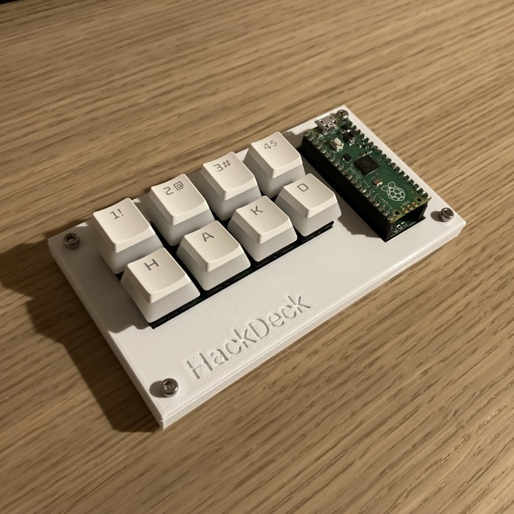

# Hack Deck

A simple macro keyboard designed from scratch.

## Overview

### Microcontroller
Raspberry Pi Pico running a simple CircuitPython firmware that acts as a USB HID keyboard.

### PCB
The board offers room for eight Cherry MX compatible switches. Each switch is wired to its own GPIO port on the Pico and all share one common ground connector.

### Case
Simple enclosure consisting of a top and bottom half.

## Part List
Other than the board and the case that can be produced from the designs, following parts are needed:
* 1x Raspberry Pi Pico
* 2x 20 pin short female header
* 8x Cherry MX compatible switch
* 8x Cherry MX compatible keycap
* 4x M3x10 screw
* 4x M3 nut

Keyswitches with fixing pins are recommended (e.g. Cherry MX1A-E1NN), as they make it easier to solder them to the PCB. For switches without fixing pins, the soldering aid included in the case designs can be used to align things evenly.
