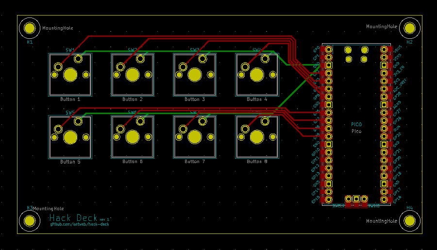

# PCB
Circuit board design to hold and connect eight keyboard switches and a Raspberry Pi Pico.

Created with KiCad 5.1.10 using [this template](https://github.com/sethhillbrand/kicad_templates/tree/master/AISLER-2Layer).

### Footprints
The design uses additional footprint libraries:
* [RP_Silicon_KiCad](https://github.com/HeadBoffin/RP_Silicon_KiCad)
* [Button_Switch_Keyboard.pretty](https://gitlab.com/kicad/libraries/kicad-footprints/-/tree/master/Button_Switch_Keyboard.pretty)