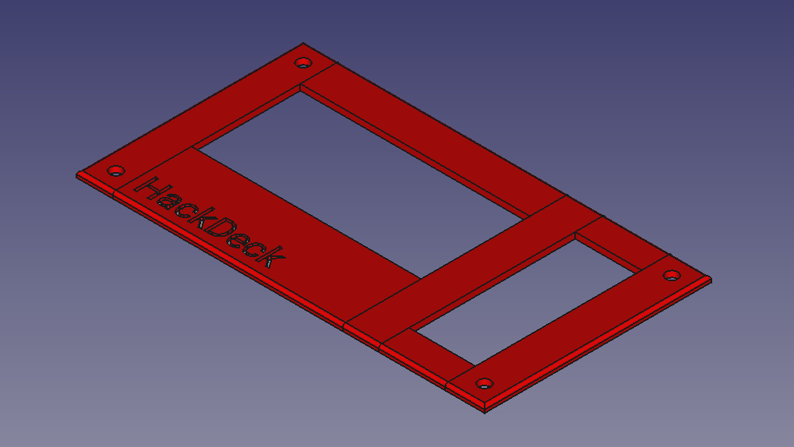

# Case
3D models for case parts.

Same as the PCB, all mounting holes are designed for M3 nuts / screws.

All files saved with FreeCAD 0.19.

### case_bottom
Bottom base that holds the PCB. Has cutouts at the bottom to hold M3 nuts in place.

### case_top
Optional top cover.

### solder_holder
Soldering aid that holds the switches in places and alings them correctly.

